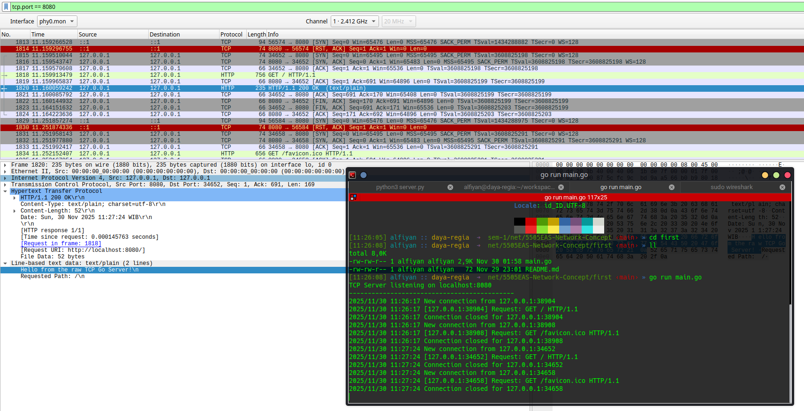

Assignment Repository URL is: https://github.com/alfiyansys/5505EAS-Network-Concept

Written by M Alfiyan Syamsuddin - 1225800008

The final semester assignment is to demonstrate how (L7 Application layer) socket programming works and its implementations on programming.

1. First Assignment: HTTP Server using RAW TCP Connections

	The first assignment is to demonstrate principles of RAW TCP socket programming and its implementations on HTTP L7 Application protocol layer. It written on Golang instead of python.

	The server is configurated to run on localhost and port 8080. Program begans with listening for incoming connections. Once a connection is established and entered main program loop, the server sends a response to the client using goroutine.

	The client's request is parsed, including IP address, port number, and HTTP method. If the HTTP protocol is present using buffered reader, the server will send a response using buffered writer that manually consutructed HTTP response.

	

2. Second project: UDP Pinger Client Impelementations
	
	The second assignment is to demonstrate how ping messages are implemented using UDP based connections. The server runtime is provided using python. Main assignment is to write up and implement pinger client. It written on Golang instead of python at first, until it was changed back to python as instructed.

	Provided python UDP ping server is slightly modified to support debugging purposes. The randominess is to simulate UDP transmission error.

	
	

	
